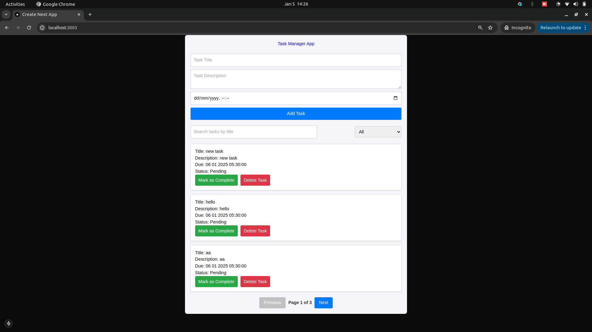

## Todo App



**Todo App** is a simple but reliable application which keep the user tasks intact, with their status, Marking the status if task is completed or passed due date. Added delete task Functionality to clean the task list once completed. Search and filter functionality is added for better User Experience.

**Key Features:**

* **Add Task:** Add task to the task list
* **Organized List:** New Task added will be shown first, with their status by default status is pending.
* **Update task** Update task status moving task to the complete state once done
* **Delete task** Delete task once done.
* **Search task** Search task based on the title of your task.
* **Search task** Filter the task based on the task status.

**Built with:**

* **Frontend:** Next js (smooth and interactive UI)
* **Backend:** Node.js & Express (efficient server-side operations)
* **Database:** MongoDB (scalable data storage)

**Getting Started**

**Prerequisites:**

* Node.js version 20 or higher (check with `node -v`)

**Frontend Setup:**

1. **Install Dependencies:**

   ```bash
   cd todo-app && npm install


1. **Start Frontend:**

    ```Bash
    npm run start


3. **Backend Setup:**


    ```Bash

    cd TodoThumbstackBackend && npm install

4. **Start Backend**

    ```Bash

    npm run dev
5. **Start using docker run command in root directory**

    ```Bash

    docker-compose up --build


**MongoDB Setup:**

* **Mongodb:** Mongo atlas is used and hosted, no need of any external setup

**Consideration after start:**
If you are starting FE and BE individually make sure to copy the env keys and start the application. Once started access the application from that hosted ports itself.

**Contribution:**

* **support:** We welcome contributions! Fork the repository, create a branch, and submit a pull request with your improvements.

**License:**

This project is licensed under the MIT License (see LICENSE file).
